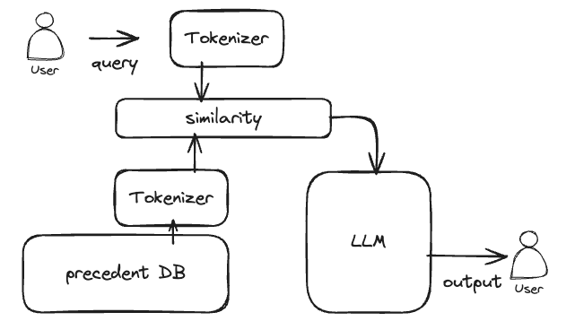
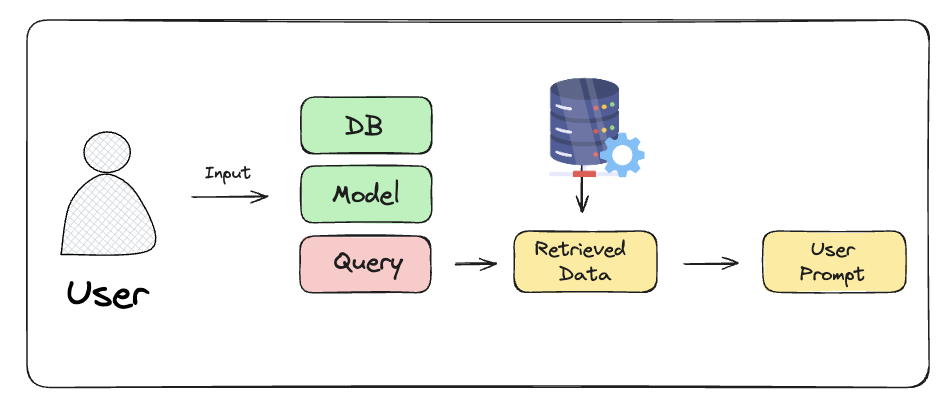
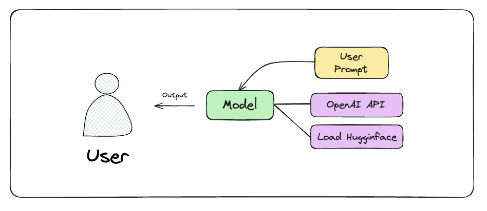

# LegalLens
Ai-x 4기 io팀 첫번째 미니 프로젝트입니다.

# 서비스 파이프라인


# Vector DB 구성
| idx | CaseSerialNumber | CaseName | CaseNumber | JudgementDate | JudgementType | CourtName | VerdictType | Matter | Summary | ReferenceArticle | ReferenceCase | Target |
|-----|------------------|----------|------------|---------------|---------------|-----------|-------------|--------|---------|------------------|---------------|--------|
|     |                  |          |            |               |               |           |             |        |         |                  |               |        |

위와 같은 Columns 로 구성되어 있습니다.
<br/>
CaseSerialNumber(=판례정보 일련번호)가 PK를 담당합니다.
<br/>
각 컬럼은 판례정보일련번호, 사건명, 사건번호, 선고일자, 선고, 법원명, 사건종류명, 판결유형, 판시사항, 판결요지, 참조조문, 참조판례, 통합텍스트를 의미합니다.
<br/>
Target 컬럼은 DB의 context 분석을 위해 새로 생성해 준 컬럼이며, Matter 컬럼과 Summary 컬럼을 Concat 하여 사용합니다.
<br/>
NULL 값은 공백으로 처리을 하여 Target Text를 생성하였으며, 판시사항과 판결요지가 없는 경우 참고할 판례가 없음을 명시하였습니다.

<br/>

# Vector DB with RAG




# app 구동
python app_start.py

# local url
http://localhost:9000/

# OPENAI API KEY 파일 생성 필수
root 영역에 .env 파일 생성 후 아래 코드 입력
```
OPENAI_API_KEY = "팀장님께_문의_후_이_부분_수정할_것"
```

# requirements.txt 사용 전 설치 목록
```
pip install fastapi
pip install "uvicorn[standard]"
pip install jinja2 python-multipart
pip install pymysql
pip install sqlalchemy
pip install langchain_openai
pip install langchain
pip install langchain-chroma
pip install langchain-core 
pip install langchain-community
pip install transformers==4.37.1
pip install sentence-transformers
pip install -U langchain-community faiss-cpu langchain-openai tiktoken
```
<br/>

- 아래 목록은 langchain을 통한 RAG 구현 데모를 위해 설치하였습니다.
<br/>

```
pip install jq
pip install faiss-gpu
pip install faiss
```