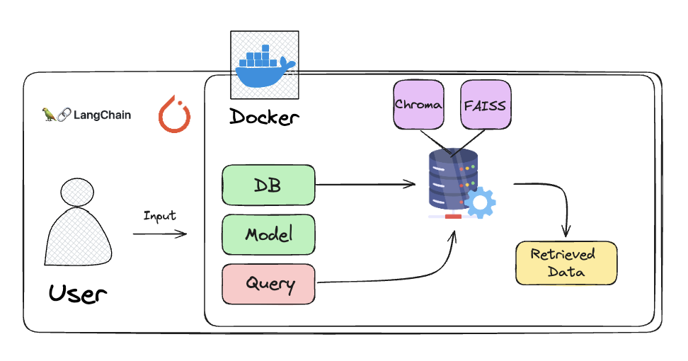

# LegalLens
Ai-x 4기 io팀 첫번째 미니 프로젝트입니다.

# 서비스 파이프라인


# app 구동
```
python app_start.py
```

# local url
http://localhost:9000/


# requirements.txt 사용 전 설치 목록
```
# requirements 사용 전 설치 목록
```
spip install fastapi
pip install "uvicorn[standard]"
pip install jinja2 python-multipart
pip install pymysql
pip install sqlalchemy
```
```